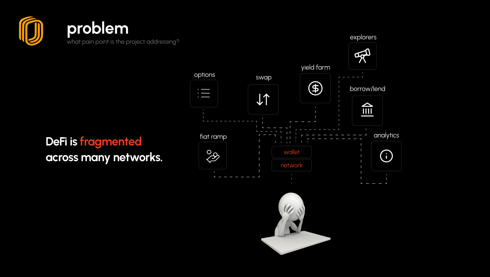
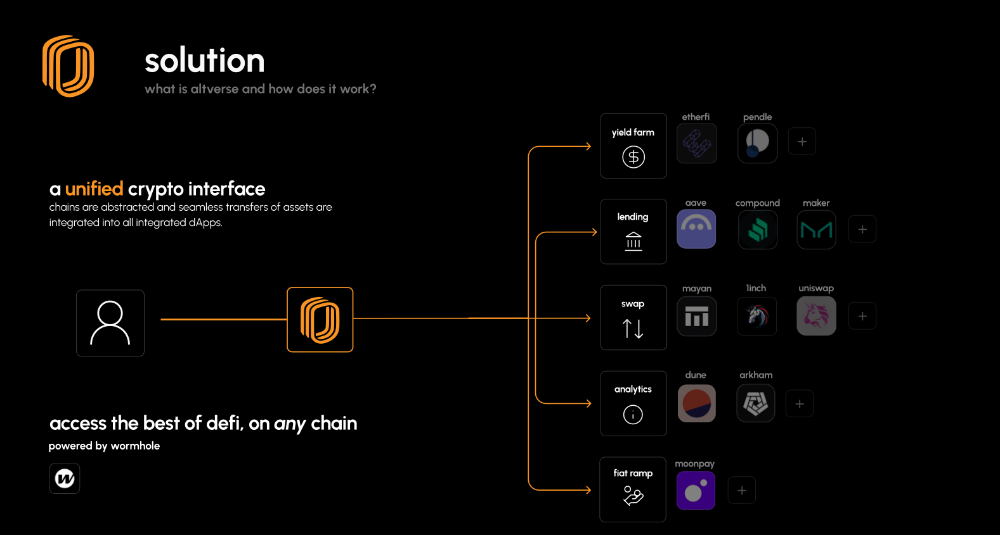

# Altverse: The Unified Crypto Interface

#### Core Features (all cross-chain/omni-chain):
- Swapping & Bridging across the EVM, Solana, and Sui ecosystems
- Automated Farming/Vaulting with optimal yields **with assets sourced from any chain**
- Lending/Borrowing at optimal rates **with assets sourced from any chain**
- Fiat on-ramp/off-ramp (coming soon)
- Cross-chain, on-chain stocks/options (coming soon)
- Omni-chain smart wallet (coming soon)
- Unified dashboard of activity (coming soon)
- Omni-chain APIs/smart contracts (coming soon)

---



Altverse is a project inspired by the many pain points associated with using the ever-growing number of useful tools and features separated by segregated protocols, chains and dApps. Altverse aims to create a unified user experience by offering exposure to the best of Web3 in a single place, regardless of what chain user assets are sourced from.

---



Our platform does more than just aggregate protocols - we abstract away complexities, giving our users a single, simple, and easy-to-use platform for all their needs.

---

## `site`
This repository is the frontend component for our project. The Altverse frontend enables users to connect up to 3 different wallets simultaneously across a selection of EVM, Solana and Sui wallets, providing an interface for users from all different chains to swap and stake tokens across Web3 seamlessly.

#### How to Run Site Locally:
```bash
# Install dependencies
npm install
# Run development server
npm run dev
```

Visit [http://localhost:3000](http://localhost:3000) to view Altverse in your browser.

---

## Quick Links
- [Website](https://altverse.finance)
- [Token Fetcher Repository](https://github.com/altverseweb3/token-fetcher)
- [Backend Repository](https://github.com/altverseweb3/backend)
